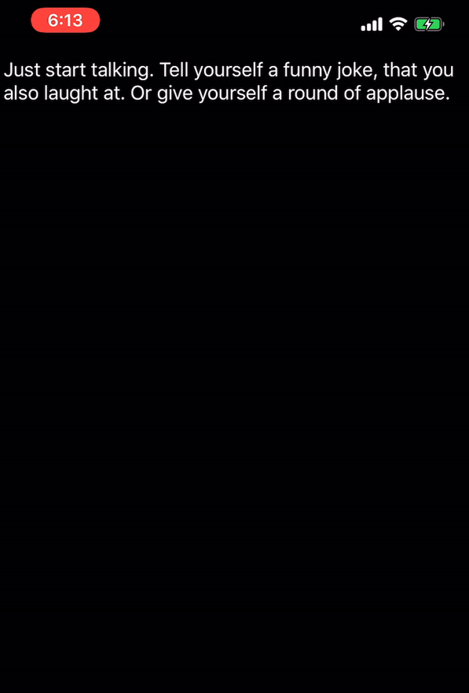

# Sound Classification with Core ML 3
## Introduction

New to iOS 13 and macOS 10.15 at WWDC 2019 this year is the ability to analyze and classify sound with machine learning in Core ML 3. A couple of new features were introduced to support this:


1. Create ML application - Create ML is now a separate app included with Xcode 11. Create ML now supports training of `MLSoundClassifier` models. 
 
1. `MLSoundClassifier` - A new model type for   Core ML3 allowing for sound classification with a pretrained `.mlmodel` file from Create ML.
 
1. `SoundAnalysisPreprocessing` —  A new  model types that can also be described by `.mlmodel` files. It takes audio samples and converts them to mel spectrograms to serve as input to an audio feature extraction model.

1. `SoundAnalysis` framework - This framework performs its analysis using a Core ML model trained by an `MLSoundClassifier`.

To show you this in action, we've built a demo app for iOS 13 and will walk you through the implementation of a sound classification model on device.

> Note on prequisites: To use Create ML and the sound classifier frameworks, you must install macOS Catalina, XCode 11, and iOS 13 on your device. These are all currently available as beta software downloads at the time of this blog post.

## The Demo App


The demo app constantly listens to audio from the microphone and attempts to classify what it hears as speech, laughter, applause and silence. When speech is picked up, the app will utilize the `SFSpeechRecognizer`  API for speech-to-text processing.  When laughter or applause is detected, the app will scroll those labels across the screen. The video above shows the demo app in action. The following blog post will focus on the sound classification capabilities of Core ML3 and not the Speech framework.

 
## Dataset

The dataset we used to build the model was extracted from [AudioSet](https://research.google.com/audioset/index.html), which is a publically available large-scale dataset of manually annotated audio events. There are 632 audio event classes from which we have selected four to use for this demo.


|  Class |  Ontology Label |
| -------- | -------- |
| Speech     | `/m/09x0r`     | 
| Laughter     | `/m/01j3sz`    | 
| Applause     | `/m/0l15bq`     | 
| Silence     | `/m/028v0c`     | 


The dataset is already annotated where each line in the .csv file indicates YouTube Video ID, start time for the audio segment, end time, and classification labels.  There may be more than one label for each sound clip. An example annotation is shown below:


| YouTube Video ID | Start Time | End Time | Labels|
| -------- | -------- | -------- |---------|
| 0FMdORf5iGs    | 30.000     | 0.000     | ``/m/04rlf,/m/081rb,/m/09x0r,/m/0l15bq``


A [script](https://github.com/unixpickle/audioset) was used to iterate through the  annotations, creating audio clips by downloading each youtube video and extracting audio as a .wav file and making a clip with the start and end times. The resulting .wav files are then placed in folders labelled `speech`, `laughter`, `applause`, and `silence` to form the training dataset. We limited ourselves to 50 samples of each training class for this exercise.

## Training the Model
Training was done very easily using Create ML, which is now provided as a separate application with XCode 11. To use Create ML to train a model, simply drag and drop the training folder into the Data Input box in Create ML. Click the play button to begin training. Create ML will handle all audio preprocessing, feature extraction, and model training for you. The training progress is shown over multiple runs and the results are displayed upon completion. You can test the results using a dataset that the model has never seen before.

Create ML greatly simplifies the time and effort to train your model. For more information about CreateML, please see this excellent blog post called [Hands on with Create ML: Machine Learning for the Masses](https://replacewithLINK) by Andrew Gray and Frankie Cleary.


On my 2018 MacBook Pro running 2.7 Ghz Core i7, it took 1 minutes 17 secs to generate a sound classification model. The results of the training in CreateML can be seen in this screenshot here.  Note the extremely small size of the model as it is a transfer model that supplements the sound classification model that comes on device. Drag and drop the trained model into your project to continue further.


## Sound Analysis

Audio input to the sound classifier can be either an audio file or a stream. Our sample application uses the mic from the iPhone as our input source.

> Note: This post does not cover `AVAudioEngine` in detail,  check out Apple's documentation in the Resources section below for additional information.


### Create a Stream Analyzer

First, get the microphone input format from the AudioEngine's `inputNode` and create a `SNAudioStreamAnalyzer` using it. It is important that the format of the `SNAudioStreamAnalyzer` matches the format of the input device. 
```swift
inputFormat = engine.inputNode.inputFormat(forBus: 0)
analyzer = SNAudioStreamAnalyzer(format: inputFormat)
```
Using `AVAudioEngine` we send mic input to the `SNAudioStreamAnalyzer` created earlier. For performance reasons it is recommended to use a dedicated serial dispatch queue.
```swift
audioEngine.inputNode.installTap(onBus: inputBus,
                                 bufferSize: 8192, // 8k buffer
                                 format: inputFormat) { buffer, time in
    
    // Analyze the current audio buffer.
    self.analysisQueue.async {
        self.streamAnalyzer.analyze(buffer, atAudioFramePosition: time.sampleTime)
    }
}
```
 Let's tie everything together by informing our analyzer about the specific model with `SNClassifySoundRequest`.


### Create a SNClassifySoundRequest
When you add a .mlmodel file to your project, perhaps from CreateML, Xcode exposes a new class with the same name. 
```swift
let soundClassifier = MySoundClassifierModel()
do {
    let request = try SNClassifySoundRequest(mlModel: soundClassifier.model)
        try analyzer.add(request, withObserver: resultsObserver)
    } catch {
            print("Unable to prepare request: \(error.localizedDescription)")
            return
        }
```
Where `resultsObserver` conforms to `SNResultsObserving` in order apply additional processing or logic depending on your own application needs.

```swift
    guard let result = result as? SNClassificationResult,
    let classification = result.classifications.first else { return }
    
    let confidence = classification.confidence * 100.0
    if confidence > 90 {
        delegate?.determinedSoundType(identifier: classification.identifier, confidence: confidence)
    }    
```
Because our sample application is going to add a label to the view, we only want to perform this action when the model has a lot of confidence in its prediction.


    

## On Device Training in iOS 13

Also new in iOS 13 this year is the ability for on-device machine learning. This allows for the user to personalize their machine learning model on their personal device without utilizing a server for privacy protection. On-device machine learning is growing in popularity as a way to improve machine learning on edge devices and respect privacy.

To check if your model supports this, the `Model` object has an `isUpdatable` property indicating if the model can be trained on-device with new data. This currently only works for neural networks and k-Nearest Neighbors which are very suitable for fast learning on device.

For more information on on-device training, please check out [WWDC 2019 Session 209 - What's New in Core ML 3](https://developer.apple.com/videos/play/wwdc2019/209/).


## Conclusion

Machine Learning has long been an intimidating topic to break into for traditional iOS developers. But with the introduction of Create ML and the innovations to CoreML, it is clear that Apple is trying to help its developers bridge the gap. Utilizing Python, TensorFlow, Jupyter etc will still have a place, but the most exciting aspect of the recent announcements is the barrier to entry is being lowered. Apple continues to shoulder large or mundane aspects of the development process so that we can focus on the idea.

Our sample application now has what amounts to a simple sound classifier, but with the tools provided to us we are now able to make machines seemingly intelligent. What machine learning enabled app are you going to make?

## Resources

To download the source code and audio annotations for the app and to check out Apple's documentation, please take a look at the links below.

| Description | Link | 
| -------- | -------- | 
| Sample App Code| https://github.com/CapTechMobile/blogfest-coreml/tree/master/ReadTheRoom     |
| Data from AudioSet| https://research.google.com/audioset/download.html     | 
| Ontology| https://github.com/audioset/ontology|
| Apple Documentation |https://developer.apple.com/documentation/soundanalysis/analyzing_audio_to_classify_sounds |
| Training Sound Classification Models with Create ML | https://developer.apple.com/videos/play/wwdc2019/425/ |
| What's New in Core ML 3| https://developer.apple.com/videos/play/wwdc2019/209/ |